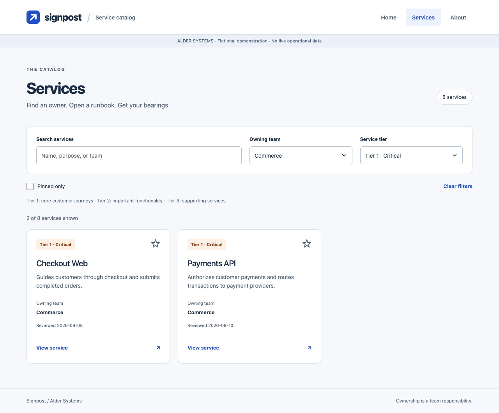
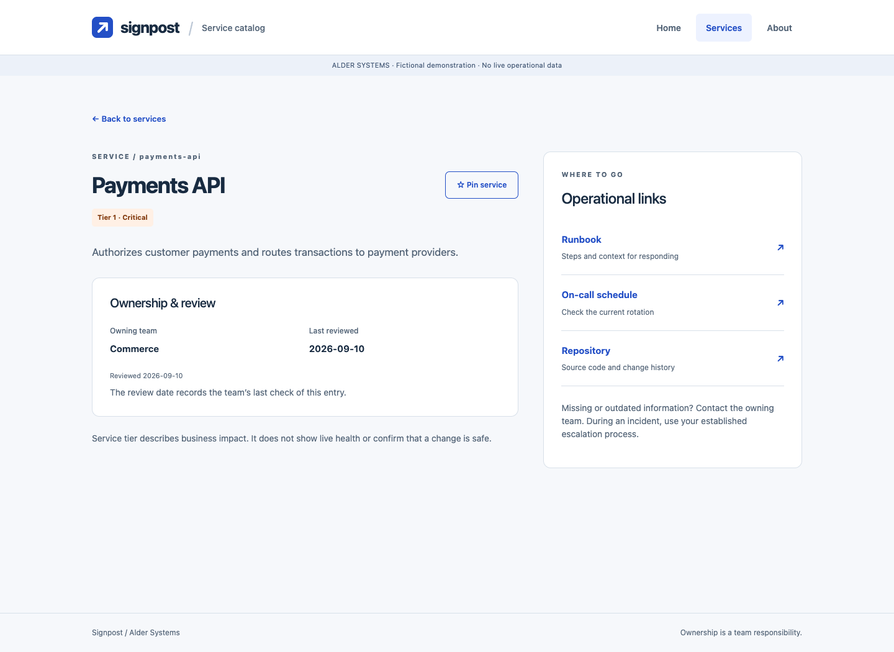
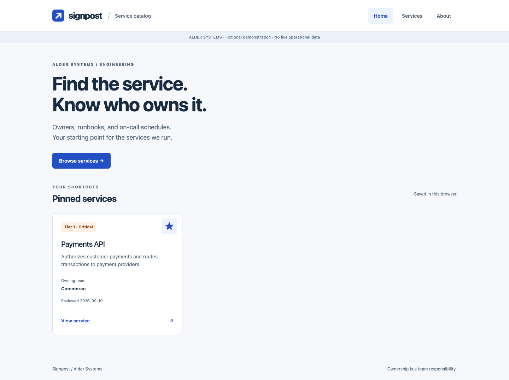
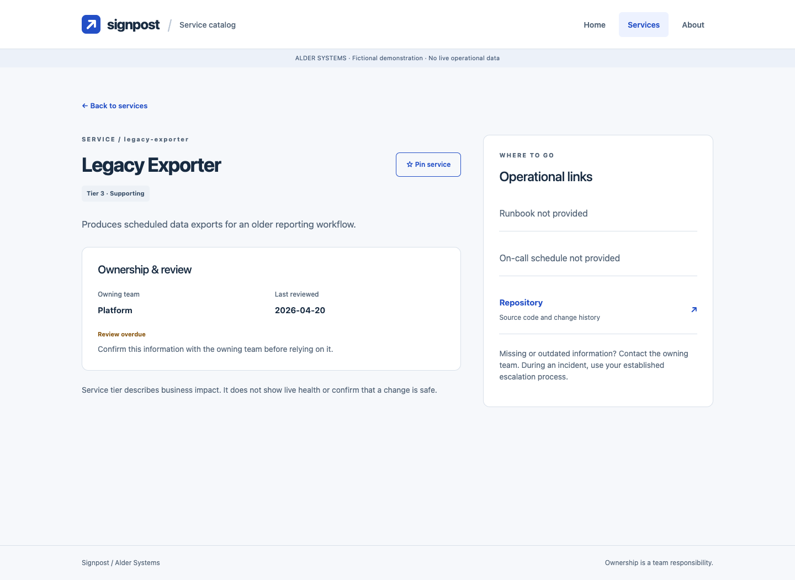

# Signpost

## Research

### Design specification and prototype study

**Alder Systems - fictional internal service catalog**  
**Prepared:** September 15, 2026  
**Continues:** the September 7, 2026 business case  
**Specification:** version 0.2

Signpost gives engineers a reliable starting point for three questions: what does this service do, who owns it, and where are its operational guides? The proposed first version is a read-only catalog with search, team and tier filters, service details, and personal pins. This study retains the business case's small scope and the existing web-app starter.

**Evidence note:** Alder Systems, its services, interview personas, responses, and participant observations are fictional. Interview and participant material is explicitly simulated at the project author's request. Competitor findings use real published documentation; prototype checks use the implemented app. No human research was conducted. If the course requires observations from actual people, the simulated material does not fulfill that requirement.

### Competitive analysis

The review compares documented features and interaction flows of three developer catalogs. It is a desk review, not a timed product trial.

| Competitor | Features and documented flow | Decision for Signpost |
| --- | --- | --- |
| Backstage | Catalog → owned/all components → search or filter → component detail → star. Owners maintain metadata in source control. [B1](https://backstage.io/docs/features/software-catalog/) | Keep find → detail → pin and owner-reviewed records. |
| Port | Catalog table → free-text search and filters → entity view. Views support sorting, grouping, and saved preferences. [P1](https://docs.port.io/interface-builder/port-interface/page/catalog-page/) | Keep simple filters visible and preserve browsing context. |
| Cortex | Global Search → enter query → select entity. Dedicated ownership features support accountable teams. [C1](https://docs.cortex.io/configure/settings/search), [C2](https://docs.cortex.io/docs/reference/basics/ownership) | Put ownership and operational links near the service title. |

**Finding:** Familiar discovery patterns fit this scenario. Signpost can adopt those patterns without implementing a configurable portal, live integrations, or provisioning. This is a design judgment, not evidence that it outperforms these products.

<!-- pagebreak -->

### User interviews - simulated

The fictional perspectives represent a regular service owner, a new engineer, and an incident responder. They were created to test the design's assumptions, not to estimate demand.

**Interview questions**

1. When you need an unfamiliar service's owner or runbook, what do you do first and next?
2. Where do you lose time or become unsure that the information is correct?
3. What would you most want to see immediately in a catalog entry?
4. What would make you trust the information enough to act on it?
5. How would you return to frequently used services, and who should correct mistakes?

| Fictional persona | Current workflow and pain point | Desired change |
| --- | --- | --- |
| Maya - backend engineer, Commerce | Searches the wiki, asks in chat, and bookmarks services. Similar names and stale runbook links cause uncertainty. | Search by name or purpose, a visible owner, direct runbook access, and personal pins. |
| Jules - new platform engineer | Uses onboarding notes and repositories, then asks colleagues. Unexplained tier numbers make criticality hard to understand. | Team filters, plain-language tier labels, and a concise service purpose. |
| Sam - on-call engineer, Reliability | Starts with the alert name, then checks the incident tool. Named people can be off shift and undated ownership may be stale. | A maintained schedule link, a last-reviewed date, and an overdue warning. |

**Summary of findings**

The simulated responses suggest four useful design priorities: quick lookup, clear ownership, visible information age, and shortcuts to recurring services. Jules's perspective motivates “Tier 1 · Critical” rather than an unexplained number. Sam's perspective motivates “On-call schedule” rather than a claim about the current person on duty. Maya's perspective supports name/purpose search and browser pins.

These hypotheses do not validate the business case's adoption, weekly time-saving, or financial assumptions. A real study would ask at least two people to attempt the same tasks without instruction, record their difficulties, and revise the specification again.

Full response notes and the evaluation protocol are in [research-notes.md](https://ryroiu.github.io/business_case/docs/design/research-notes.md) after publication.

<!-- pagebreak -->

### Technical feasibility check

**Conclusion:** A small static prototype is feasible with the repository's current tools. Readiness for real internal use depends on access-controlled hosting and owner-reviewed service records.

| Area | Finding and implementation decision |
| --- | --- |
| Existing structure | Retain Vue, Vue Router, Bootstrap, Papa Parse, and the four Home/Services/Detail/About routes. Hash routing works without server-side route rewrites. [T1](https://router.vuejs.org/guide/essentials/history-mode.html) |
| Catalog data | Papa Parse supports header-based CSV parsing and error reporting. Retain the six starter columns and add repository, runbook, schedule, and review-date fields. Validate unique IDs, required data, and tiers. [T2](https://www.papaparse.com/docs) |
| Personal pins | Browser localStorage supports persistence but may be unavailable. Keep session-only pins with a visible explanation when blocked; pins do not synchronize across devices. [T3](https://developer.mozilla.org/en-US/docs/Web/API/Window/localStorage) |
| Hosting and privacy | GitHub Pages supports static files and suits this fictional public demonstration. Real service metadata and the CSV must be behind staff access controls. A frontend without its own login is not an access-control boundary. [T4](https://docs.github.com/en/pages/getting-started-with-github-pages/what-is-github-pages) |
| Operational accuracy | A static catalog cannot reliably identify the person currently on call. Link to the maintained schedule, show when ownership was reviewed, and mark reviews older than a proposed 90-day threshold. |
| Reliability | Show retry on loading or invalid-file errors; distinguish empty results, missing destinations, and unknown service IDs. Render CSV text safely and disable unsafe links. |

**Changes to the business-case assumptions**

The original “no schema design” wording is too strong: even a ten-column file needs field definitions and validation. “No authentication” now means no custom login in the app; real hosting must still restrict access. A catalog also cannot establish that a production change is safe without dependency and operational context.

The demonstration contains eight fictional records across five teams. A synthetic 70-record browser check supports the feasibility of client-side filtering, but is not a production load study. The ten-week plan and labor estimates from the business case remain planning assumptions. Catalog seeding, approval ownership, protected hosting, and external-library availability still need confirmation before a real rollout.

<!-- pagebreak -->

## Prototype Evaluation

### Prototype and task coverage

The digital prototype adapts the existing starter. Its working flows are:

1. Home → Services → search for Payments API → detail → sample runbook.
2. Services → Commerce + Tier 1 filters → service detail → return with filters retained.
3. Pin a service → Home → refresh → find the same pinned service.
4. Open Legacy Exporter → recognize overdue review and missing operational links.

Operational links open clearly labeled sample resources. No live runbook, paging service, or internal repository is contacted.

### Three usability observations and responses

| Evidence type | Observation | Design response |
| --- | --- | --- |
| Simulated participant: Jules | In a critique of the initial design, abbreviated tier numbers would require explanation before a new engineer could interpret them. | Pair numbers with Critical, Important, and Supporting; explain tier meanings beside the filters. |
| Simulated participant: Sam | A generic on-call action without a review date could be mistaken for current shift information. | Use “On-call schedule,” add `last_reviewed`, and show overdue or unverified review states. |
| Actual prototype evaluation: author/assistant browser walkthrough | Initial-load heading focus caused the first Tab to skip the skip-to-content link. | Move heading focus only on in-app navigation. Recheck initial keyboard entry and navigation focus. |

The first two observations are fictional scenario-based critiques, not recordings of real people using the interface. They identify plausible issues to test. The third is an observed implementation issue that was corrected and checked again.

### Verified behavior

Browser checks passed for the main journeys, combined filters, return-state preservation, pin persistence and storage fallback, mobile overflow, keyboard entry, unknown IDs, missing links, overdue/future review dates, invalid CSV, and retry recovery. A local synthetic 70-service test returned the filtered result in **12 ms**; this is one observed implementation check, not a human completion time. No uncaught page errors were recorded in the test run.

**Limits:** The checks used local Chrome at desktop and mobile viewport sizes. They do not establish real-user task success, cross-browser compatibility, full accessibility compliance, initial-load performance on slower networks, or correct production data. The target of finding an owner and runbook within 30 seconds remains unvalidated by humans. [Detailed browser check record](https://ryroiu.github.io/business_case/docs/design/browser-checks.md) is included in the repository.

<!-- pagebreak -->

### Prototype images - finding a service

**Figure 1. Filtered catalog.** Commerce + Tier 1 returns Checkout Web and Payments API. Ownership, purpose, and full tier labels are visible on each card. Returning from a detail retains the selections. Search and Clear filters support recovery without leaving the page.

The prototype retains one simple list-to-detail journey. It makes the information needed for the next action visible before someone opens a record. Decorative image space is omitted when no architecture image is supplied.

<!-- pagebreak -->

### Prototype images - ownership and operational links

**Figure 2. Service detail.** The owner and review date sit beside the runbook, on-call schedule, and repository destinations. “On-call schedule” describes the destination accurately; the app does not claim to know the current responder. The pin button creates a personal shortcut.

The review date is an attestation date, not a live service-health indicator. Incomplete entries remain visible and identify missing destinations rather than offering broken actions.

<!-- pagebreak -->

### Prototype images - recurring work and exceptions

**Figure 3. Pinned Home.** Saved services appear under “Your shortcuts.” The view states that pins are saved in this browser; they survive an ordinary refresh without a user account.

<!-- pagebreak -->

### Prototype images - recognizing incomplete information

**Figure 4. Incomplete record.** Legacy Exporter retains its accountable team but warns that the review is overdue. Missing runbook and on-call links are explicit. Additional mobile captures are included with the project files.

<!-- pagebreak -->

## Specification

### Revised source of truth

The revised specification is stored at **docs/design/specification.md** and follows the supplied template's structure: Style and Theme, User Scenarios, Requirements, Key Data, Success Criteria, and Assumptions.

**Required public link:** [Signpost specification](https://ryroiu.github.io/business_case/docs/design/specification.md).

**Publication status, September 15, 2026:** the URL returned HTTP 200, but it still displayed the original “Your App Idea Name” template when checked. Version 0.2 is complete locally and has not been published. The revised specification and new report links must be published before this PDF can be treated as a submission with a verified current public specification.

| Specification area | Revision after research and evaluation |
| --- | --- |
| Style and theme | Prioritize names and owners; omit empty image space; pair tiers with explanatory labels. |
| User scenarios | Include stale/incomplete information and distinguish schedule links from current responders. |
| Functional requirements | Define combined filters, retained browsing context, personal pins, retry, and missing-data behavior. |
| Data model | Add review date, exact field meanings, validation, and safe destination rules. |
| Success criteria | Separate browser-verifiable behavior from human comprehension and timed-task targets. |
| Assumptions | Separate the fictional public demo from a real catalog behind protected hosting. |

**Ready now:** revised specification, initial draft, research notes, simulated interview and participant material, working prototype, screenshots, and PDF export. **Before submission:** publish the revision, reopen the public link to verify version 0.2, and confirm that simulated research is permitted by the course; if it is not, replace it with real observations and revise the report.

### Sources and supporting files

Competitors: [Backstage](https://backstage.io/docs/features/software-catalog/), [Port](https://docs.port.io/interface-builder/port-interface/page/catalog-page/), [Cortex search](https://docs.cortex.io/configure/settings/search), [Cortex ownership](https://docs.cortex.io/docs/reference/basics/ownership).

Technical references: [Vue Router](https://router.vuejs.org/guide/essentials/history-mode.html), [Papa Parse](https://www.papaparse.com/docs), [MDN localStorage](https://developer.mozilla.org/en-US/docs/Web/API/Window/localStorage), [GitHub Pages](https://docs.github.com/en/pages/getting-started-with-github-pages/what-is-github-pages).

All external documentation was consulted September 15, 2026. Local supporting files include specification-v0.1.md, research-notes.md, browser-checks.md, style-guide.html, and the images folder under docs/design. The original business case is retained.
